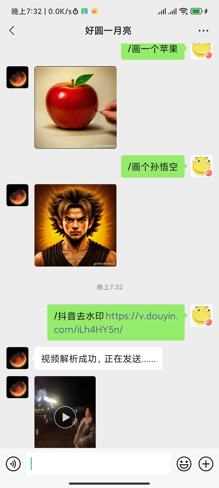
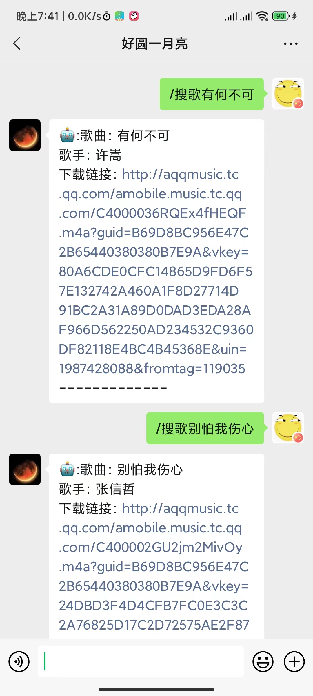
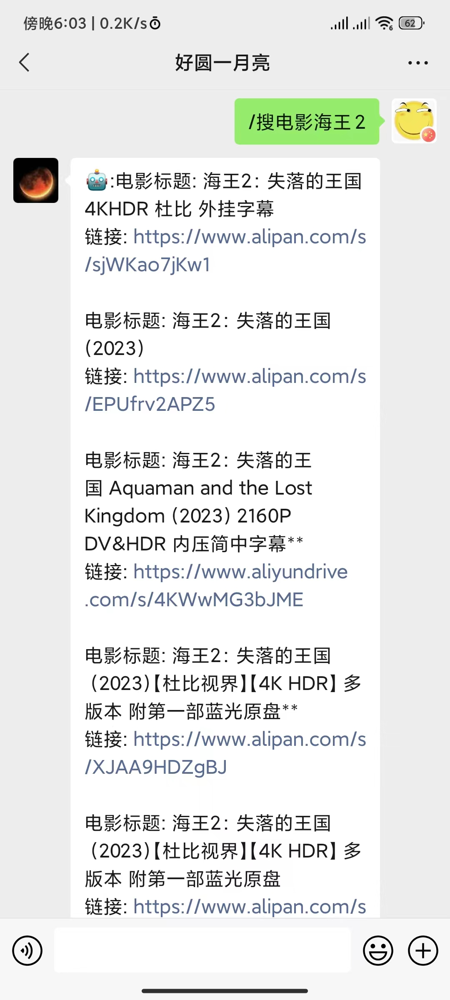
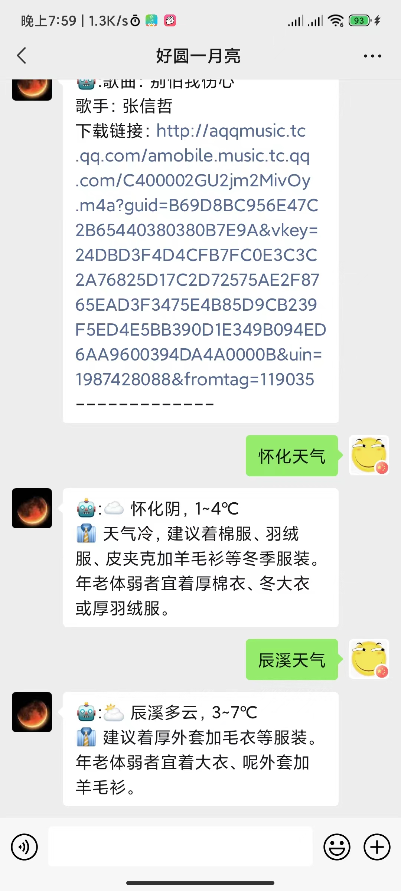
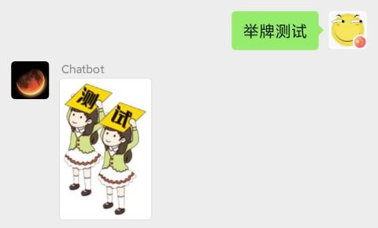

# bot

## 简介
本项目使用 [WeChatFerry](https://github.com/lich0821/WeChatFerry) 库控制 Windows PC 桌面微信客户端, 调用 OpenAI Assistant API 进行智能多模态消息处理。 
- 在微信中与 AI 对话, 自动完成绘图、搜索歌曲、电影、解析视频等多模态任务。
- 使用 WeChatFerry 接入 Windows 桌面版微信, 对微信的兼容性高(无需实名认证), 风险低。
- 使用 OpenAI Assistant API 自动管理群聊对话上下文。

## Chatbot详细指令
  一、好友私聊
  
    1.chatgpt：直接交流会自动调用chatgpt3.5语言模型，预设人格为AI智能机器人，帮助完成日常疑难解答
    
    2.AI绘图：（此功能较为鸡肋）交流中使用“/画”触发，返回图片文件
    
    3.抖音去水印：使用“/抖音去水印”触发，返回无水印视频文件
    
    4.搜歌：使用“/搜歌”触发，返回歌曲对应直链，复制浏览器打开自行下载
    
    5.搜电影：使用“/搜电影”触发，返回各大网盘链接

    6.天气查询：自动判断关键词天气，当关键词出现在消息结尾时则调用该分支获取天气信息

   # 使用案例
    
    - /画一个苹果
    
    - /抖音去水印https://v.douyin.com/iLh4HY5n/
    
    - /搜歌有何不可
    
    - /搜电影海王2

    - 怀化天气
    
     

  二、群聊

  1.举牌：输入文本 举牌测试 （更改相应参数可有不同结果）
  
  
  
  2.小姐姐、买家秀：随机输出一张相应的图片
  
  3.小美女、小哥哥：随机输出一个相应的视频 
  
  4.搜歌：输入文本 /搜歌有何不可 可得如下图所示结果（更改相应参数可有不同结果）
  
  5.抖音去水印：输入文本 /抖音去水印 + url 即可获取该抖音url的无水印视频文件
  
  6.群管功能：由管理员添加关键词，群员消息触发后直接踢出
  
  7.群消息防撤回（支持文本消息、emoji表情包）

  8.搜电影：使用 /搜电影 触发，返回各大网盘链接

  9.天气查询
  
  10.Chatgpt：群聊中直接@chatbot可直接调用gpt3.5模型

## 资源

- 鸣谢: 本项目基于 WeChatFerry. 感谢 lich0821 大佬的 [WeChatFerry 项目](https://github.com/lich0821/WeChatFerry)
- 推荐: 一键部署自己的ChatGPT网站 [ChatGPT-Next-Web 项目](https://github.com/Yidadaa/ChatGPT-Next-Web)

  
  
  
  

